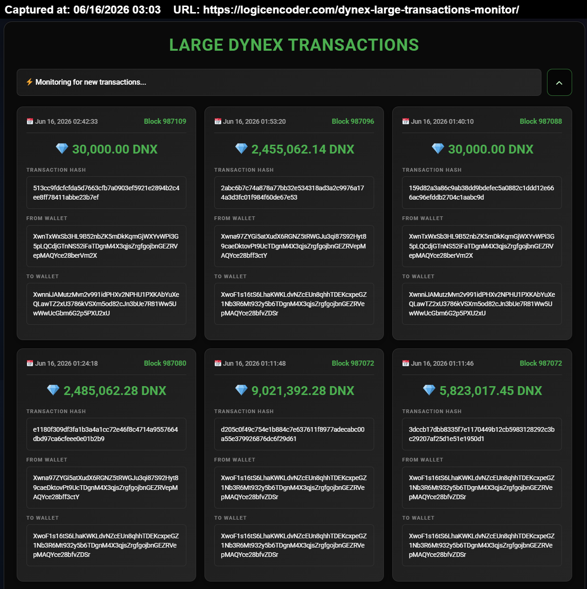
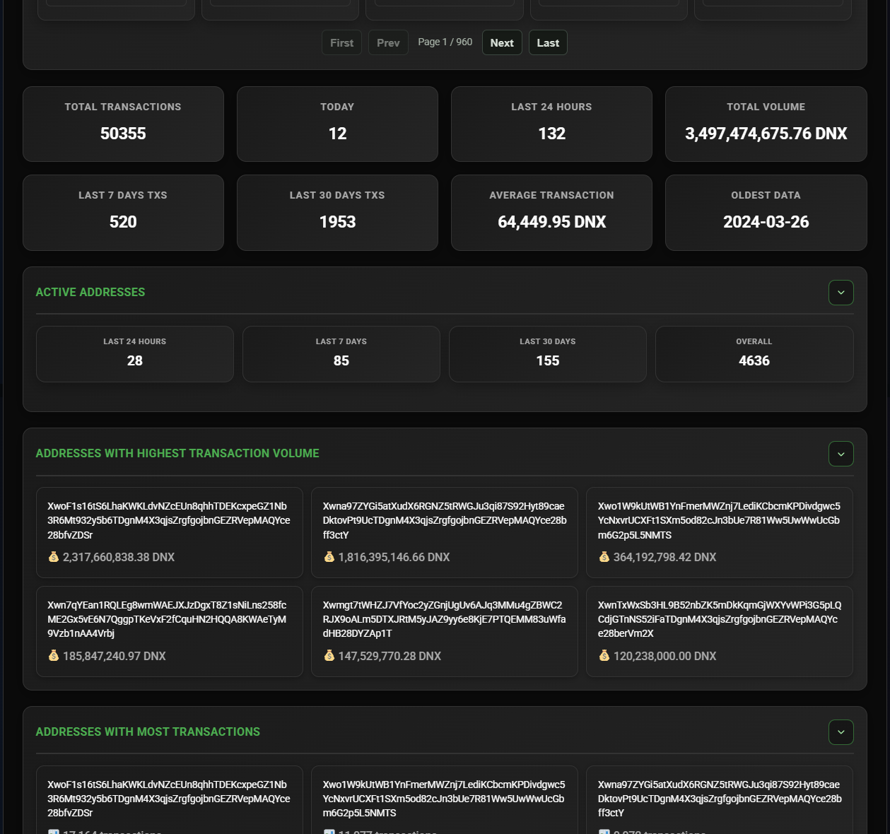
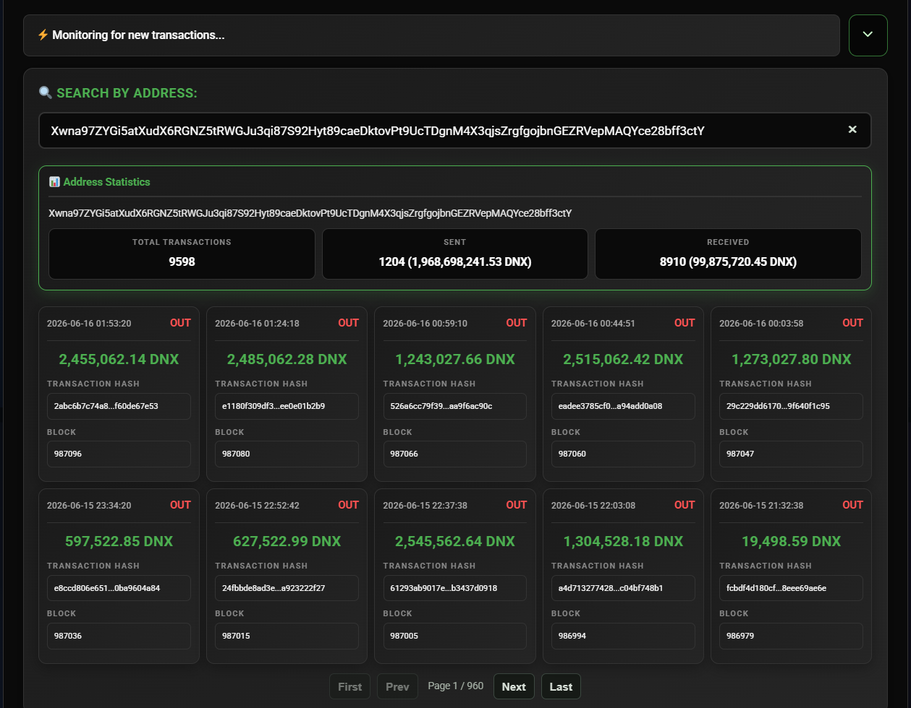
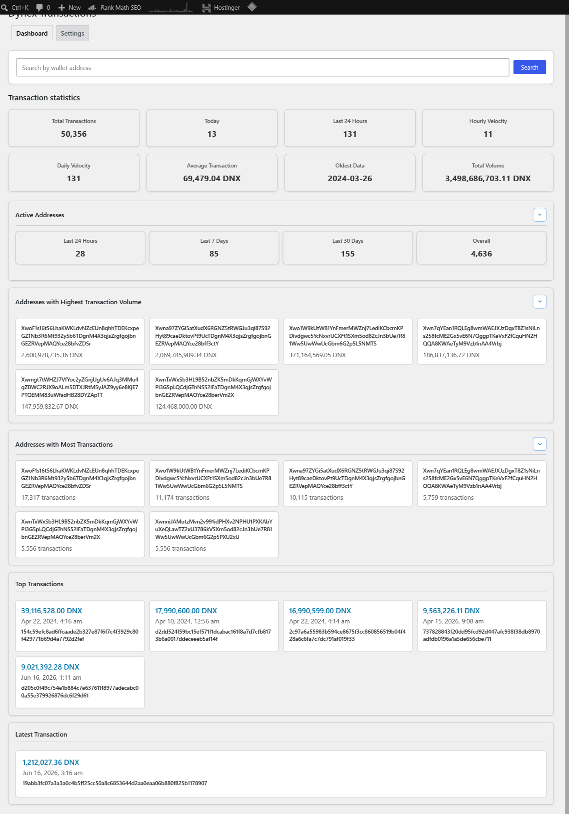
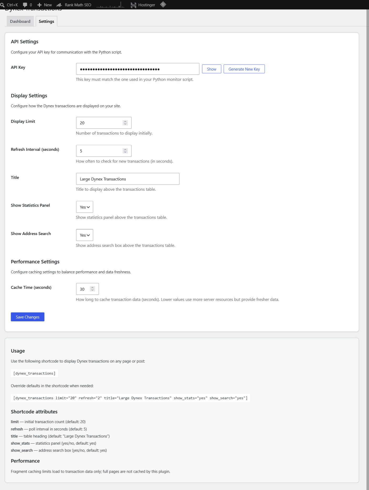

# Dynex Large Transactions — WordPress plugin



**Large on-chain DNX transfers** in one place — ranked cards, aggregate network stats, and wallet-level search without running a Dynex node or parsing block explorer pages by hand. Traders, researchers, and community members use [logicencoder.com/dynex-large-transactions-monitor/](https://logicencoder.com/dynex-large-transactions-monitor/) to watch whale-sized moves and drill into any wallet’s send/receive history.

A private Python monitor polls the Dynex chain, filters transfers above a size threshold, and pushes batches into WordPress. The public page polls for new rows on a short interval so the tape and stat cards stay current during active periods without a full browser reload.

## Tech stack

| Layer | Technologies |
|-------|--------------|
| WordPress plugin | PHP (single-file ~3.6k LOC), shortcode, wp-admin UI, WordPress AJAX, WordPress REST ingest |
| Public UI | HTML, CSS (Roboto, dark theme), JavaScript (jQuery, live poll, load-more, address search) |
| WordPress database | MySQL — custom table `wp_dynex_transactions` with unique `tx_hash` |
| Chain monitor | Python 3, Dynex JSON-RPC, SQLite buffer, authenticated REST push — see [monitor overview](https://github.com/logicencoder/dynex-large-transactions-monitor-overview) |
| Ingest | `POST` with `X-API-Key` header; `INSERT IGNORE` per hash for idempotent replay |
| Caching | Object-cache group for shortcode fragments; LiteSpeed no-cache on shortcode pages; purge on ingest |
| Explorer links | Dynex block explorer URLs on block, transaction hash, and wallet fields |

## Transaction feed

The **card grid** is the default view when statistics and search are collapsed or disabled. Each card is built from the same markup for the initial shortcode render, **Load more**, and **check-new** poll responses so layout never drifts between first paint and live updates.

| Field | Role |
|-------|------|
| **Date/time** | When the transfer was recorded on-chain |
| **Block** | Block number — links to the Dynex explorer |
| **Amount** | Formatted DNX with thousands separators and two decimal places |
| **Transaction hash** | Full hash with explorer link |
| **From wallet** / **To wallet** | Sender and recipient addresses with explorer links |

**Load more** appends the next batch ordered by newest first without reloading the page. The button hides when every stored row is visible. While fetching, a loading label appears beside the button.

**Live monitoring** runs on the **Refresh interval** from settings (seconds). Each tick calls WordPress AJAX `dynex_check_new` with the latest timestamp the browser already has. When newer rows exist, they prepend to the grid with a short slide-in animation and the status line updates. When only aggregate stats changed, the poll can refresh stat HTML in place.

Collapse the entire search and statistics band with the **chevron** beside the status line to focus on the tape only — the same layout visitors see when `show_stats` and `show_search` are off.


## Summary statistics

When **Show statistics panel** is enabled, a band of metric cards sits above the transaction grid. Counts and volumes are computed from the plugin database on each render (with fragment caching keyed by shortcode attributes), not from live RPC on every page view.

The **main grid** exposes network-wide counters:

| Stat | Meaning |
|------|---------|
| **Total transactions** | Rows stored since indexing began |
| **Today** | Transfers whose on-chain date is the current calendar day |
| **Last 24 hours** | Row count in the rolling twenty-four-hour window |
| **Total volume** | Sum of parsed DNX amounts across all rows |
| **Last 7 days txs** / **Last 30 days txs** | Transfer counts in those windows |
| **Average transaction** | Total volume divided by row count |
| **Oldest data** | Date of the earliest indexed transfer |

Three **collapsible sections** below the grid add drill-down lists. Chevron toggles remember open/closed state in `localStorage` per page and section:

- **Active addresses** — distinct wallet participation in 24h, 7d, 30d, and all-time windows (from + to wallets counted).
- **Addresses with highest transaction volume** — top six wallets by summed DNX moved (both directions).
- **Addresses with most transactions** — top six wallets by transfer count.

Clicking a wallet tile in either ranked list runs **address search** for that address (same flow as typing in the search box).



## Address search

The **Search by address** field filters the public view to one wallet. Submitting a query loads paginated results through the public search API: sent and received counts, volume totals, and a table of recent transfers with **IN** / **OUT** direction relative to the searched address.

Search results render inside the results panel above the global stats band. **Clear** (×) resets the field and hides inline results. Pagination controls walk additional pages when the wallet has more history than one batch.

From wp-admin **Dashboard**, operators use the same search box to open **address details** — totals, direction split, and a ten-row preview table with explorer links — without leaving the admin screen.



## Shortcode embed

Place the monitor on any WordPress page or post:

```
[dynex_transactions]
```

Defaults come from wp-admin **Settings**; override per page with attributes:

| Attribute | Purpose | Default (from settings) |
|-----------|---------|-------------------------|
| `limit` | Initial card count | 20 |
| `refresh` | Seconds between `dynex_check_new` polls | 2 |
| `title` | Heading above the widget | Large Dynex Transactions |
| `show_stats` | Statistics band (`yes` / `no`) | yes |
| `show_search` | Address search box (`yes` / `no`) | yes |

Example with a txs-only embed on a sidebar page:

```
[dynex_transactions limit="10" refresh="5" show_stats="no" show_search="no"]
```

## Chain monitor

**`dnx_large_txs.py`** watches the Dynex node, applies the large-transfer threshold, buffers in SQLite, and POSTs batches to this plugin. Service behaviour, CLI flags, and multi-site push patterns are documented in [dynex-large-transactions-monitor-overview](https://github.com/logicencoder/dynex-large-transactions-monitor-overview). The WordPress plugin never opens an RPC connection — it only stores, serves, and displays ingested rows.

## WordPress admin

Top-level **Dynex Transactions** in the wp-admin sidebar (chart icon) replaces the old buried settings screen. **Plugins → Installed Plugins** also exposes a **Settings** action link next to Deactivate.

Two tabs share one menu entry:

### Dashboard

The **Dashboard** tab mirrors the live statistics layout in a light WordPress admin theme — same card grid, collapsible address sections, **Top transactions** (largest individual transfers), and **Latest transaction** snapshot. A wallet search bar at the top filters into **address details** when an `address` query parameter is present.

Clickable address tiles in the ranked lists reload the dashboard with that wallet selected. The legacy **Dashboard** home widget still refreshes every thirty seconds and links through to the full admin dashboard and settings tabs.



### Settings

**Settings** holds operator controls and shortcode documentation:

- **API key** — shared secret for monitor REST pushes; masked by default with **Show** / **Hide**; **Generate New Key** rotates locally before save.
- **Display limit** — initial public card count (minimum 5).
- **Refresh interval** — poll period in seconds for `dynex_check_new`.
- **Title** — default heading on the public page.
- **Show statistics panel** / **Show address search** — yes/no toggles for the public bands.
- **Cache time** — object-cache TTL for shortcode fragments (10–300 seconds); lower values trade server work for fresher first paint.

The **Usage** block below the form lists the shortcode and attributes so operators can copy embed examples without opening PHP.



Private code: [dynex-large-transactions-plugin](https://github.com/logicencoder/dynex-large-transactions-plugin) · chain monitor [dynex-large-transactions-monitor-overview](https://github.com/logicencoder/dynex-large-transactions-monitor-overview)

See [REPOS.md](REPOS.md).

---

**Made by [Logic Encoder](https://logicencoder.com)** · [GitHub](https://github.com/logicencoder) · [Contact](https://logicencoder.com/contact/)
